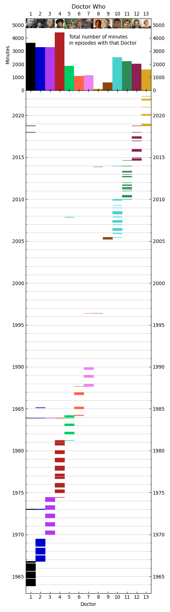

# Doctor Who episode timeline plot
This repository holds a python script `dwepisodetimeline.py`, which reads in data from `DWAllEpisodes_to2022-04.csv`, and creates a plot, `DWepisodes_pythonplot.png`.

The code was been developed/tested under the following versions:
* Python 3.8.11
* Numpy version 1.21.2
* Matplotlib version 3.3.4
* Pandas version 1.2.5

The plot looks like this:

## To Do
* I think those thumbnails need improving.
